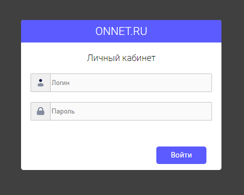
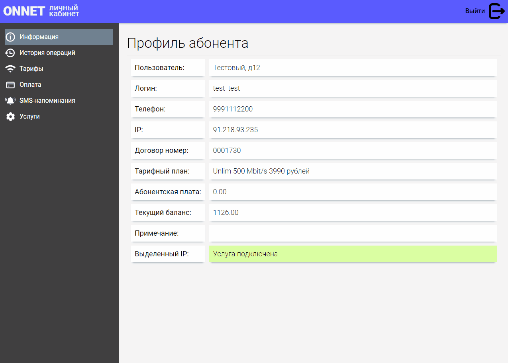

# ONNET Cabinet (личный кабинет)
Личный кабинет провайдера связи для пользователей, построен на основе старого личного кибинета.

#### Остальные связанные репозитории:
* [|onnet_cabinet| + |onnet_web|+ |nginx| (Docker)](https://github.com/sita8281/onnet_services)
* [onnet_web](https://github.com/sita8281/onnet_web.git)

#### Backend:
* FastAPI 
* billing API (httpx + bs4)

#### Frontend:
* JavaScript (vanilla)
* SPA

#### Billing API:
Удобная API обёртка над старым личным кабинетом уже существующей Billing системы.<br>
Запросы выполняются с помощью асинхронного HTTP клиента httpx, парсинг выполняется на BeautifulSoup4 с lxml. В итоге api предоставляет удобные асинхронные функции (интерфейсы) для FastAPI


## Установка и запуск
клонируем
```
git clone https://github.com/sita8281/onnet_cabinet_demo.git
```

собираем Docker-image
```
sudo docker build -t onnet_cabinet:v1 <путь к проекту>
```

запуск (interactive)
```
sudo docker run -it -p 80:8000 onnet_cabinet:v1
```

## Demo






